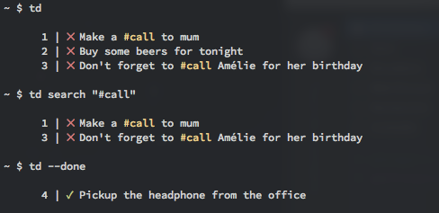

# td [](https://travis-ci.org/Swatto/td)

> Your todo list in your terminal.
>
> 

## Usage

### Installation

- With [Homebrew](http://brew.sh/): `brew install td`
- From *binary*: go to the [release page](https://github.com/Swatto/td/releases)
- From *source*: `go get github.com/Swatto/td`

### Information

*td* will look at a `.todos` files to store your todos (like Git does: it will try recursively in each parent folder). This permit to have different list of todos per folder.

If it doesn't find a `.todos`, *td* use an environment variable to store your todos: `TODO_DB_PATH` where you define the path to the JSON file. If the file doesn't exist, the program will create it for you.

### CLI

```
NAME:
   td - Your todos manager

USAGE:
   td [global options] command [command options] [arguments...]

VERSION:
   1.2.0

AUTHOR:
  Gaël Gillard

COMMANDS:
   add, a       Add a new todo
   modify, m    Modify the text of an existing todo
   toggle, t    Toggle the status of a todo by giving his id
   clean        Remove finished todos from the list
   reorder, r   Reset ids of todo
   search, s    Search a string in all todos
   help, h      Shows a list of commands or help for one command

GLOBAL OPTIONS:
   --done, -d           print done todos
   --all, -a            print all todos
   --help, -h           show help
   --version, -v        print the version
```

## License

The MIT License (MIT)

Copyright (c) 2015 Gaël Gillard

Permission is hereby granted, free of charge, to any person obtaining a copy
of this software and associated documentation files (the "Software"), to deal
in the Software without restriction, including without limitation the rights
to use, copy, modify, merge, publish, distribute, sublicense, and/or sell
copies of the Software, and to permit persons to whom the Software is
furnished to do so, subject to the following conditions:

The above copyright notice and this permission notice shall be included in all
copies or substantial portions of the Software.

THE SOFTWARE IS PROVIDED "AS IS", WITHOUT WARRANTY OF ANY KIND, EXPRESS OR
IMPLIED, INCLUDING BUT NOT LIMITED TO THE WARRANTIES OF MERCHANTABILITY,
FITNESS FOR A PARTICULAR PURPOSE AND NONINFRINGEMENT. IN NO EVENT SHALL THE
AUTHORS OR COPYRIGHT HOLDERS BE LIABLE FOR ANY CLAIM, DAMAGES OR OTHER
LIABILITY, WHETHER IN AN ACTION OF CONTRACT, TORT OR OTHERWISE, ARISING FROM,
OUT OF OR IN CONNECTION WITH THE SOFTWARE OR THE USE OR OTHER DEALINGS IN THE
SOFTWARE.
